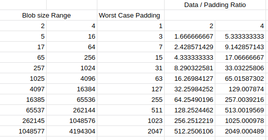
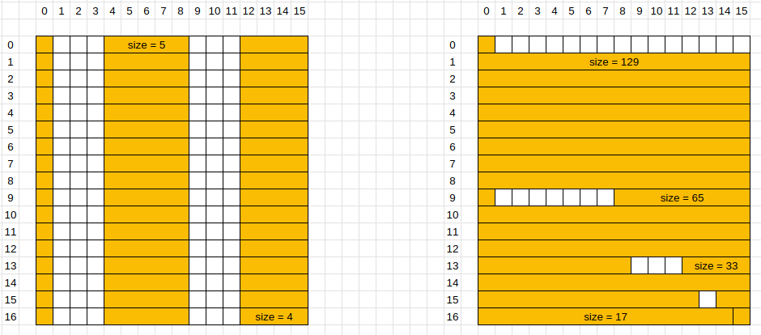

# ADR 013: Non-Interactive Default Rules for Zero Padding

## Changelog

- 03.01.2023: initial draft

## Context

When laying out blobs in the square we create padding to follow the non-interactive default rules. With ADR 009 we decreased padding by aligning the blob in the square to the index of the `MinSquareSize` of the given blob. This is a good improvement but we can do better.

Looking at different ranges of blob sizes we can see that the ratio of blob size to padding is not constant. Insight:  **The ratio of blob size to padding is smaller for smaller blobs and larger for larger blobs.** The bigger the ratio the better.

This means small blobs generate more possible padding in comparison to the data they provide. This is not ideal as we want to have as little padding as possible. As padding is not being paid for there is no incentive to use larger blobs.

In the naive approach if you align the blob at an index of one you get zero padding as each blob can follow the next. This would make the hash of each share a subtree root. In a square with N shares, you would always get N subtree roots. But having a blob inclusion proof of size N for large blobs is too much and unfeasible.

Small blob sizes have the lowest ratio but also small inclusion proofs. Therefore increasing the proof size is not a problem until some threshold. It would increase the ratio of blob size to padding for small blobs which have the worst ratio.

Assuming there is a threshold, **the number of subtree roots in a proof**, where the proof size of a blob is acceptable, we can use this threshold to determine the index of the blob in the square. This would give us zero padding for blobs that are smaller than the threshold and non-zero padding for blobs that are larger than the threshold but still smaller than before.

Let's assume a good threshold assumption is that the number of subtree roots in a blob inclusion proof is acceptable if it is smaller than the `MaxSquareSize`. This would mean that the blobs smaller than the square size can use the index of one to get zero padding. Blobs that are larger than `MaxSquareSize` but smaller than `MaxSquareSize * 2` can use the index of two to get a maximum of 1 padding square. Blobs that are larger than `MaxSquareSize * 2` but smaller than `MaxSquareSize * 4` can use the index of 4 to get a maximum of 3 padding shares and so on.

The new non-interactive default rules would be:

Blobs start at an index that is equal to a multiple of the blob length divided by `MaxSquareSize` rounded up.

If the blob length is smaller than `MaxSquareSize` then the blob starts at index 1.
`MaxSquareSize` can be changed to another threshold. The smaller the threshold the more padding we will have.

The picture below shows the difference between the old and new non-interactive default rules in a square of size 8 and a threshold of 8.

## Analysis

### Light-Nodes

The Proof size is bounded by the number of subtree roots in the blob inclusion proof. If the new bound is the `MaxSquareSize` then the worst case for the number of subtree roots in a blob inclusion proof will be `MaxSquareSize`.

If Light-Nodes can process this proof size without a problem then we can use this bound. If not, we can use a smaller bound. The smaller the bound the more padding we will have.

In addition, we could use PFB inclusion proofs (ADR 11) to reduce the proof size of the blob inclusion proof for Light-Nodes. This would make this change not noticeable to them as they are blob size independent until we need a fraud-proof for a malicious PFB inclusion.

This fraud-proof would still be magnitudes smaller than a bad encoding fraud-proof. Both cases require 2/3 of the Celestia validators to be malicious. In both cases, the chain would halt and fall back to social consensus. If a Light-Node can process the bad encoding fraud-proof then it can also process the PFB fraud-proof easily.

### Partial-Nodes

Partial nodes in this context are Celestia-node light nodes that may download all of the data in the reserved namespace. They check that the data behind the PFB was included in the `DataRoot`, via blob inclusion proofs.

The sum of the size of all blob inclusion proofs will be larger than the sum with the previous non-interactive default rules.

In the current worst case a Celestia block is full of blobs of size 1, making the total amount of subtree roots that need to be downloaded O(n) where n is the number of shares in a block. With the new non-interactive default rules, the worst case stays the same, but the average case goes up. If the block is filled with blobs that are smaller than the threshold then the partial node will still need to download O(n) subtree roots.

### Worst Case Padding

If we choose the threshold to be the `MaxSquareSize` then the worst-case padding will be approaching 2 rows of padding. This means that this scales very well as no matter how large the blob is, the worst-case padding will be at most 2 rows of padding if we adjust the threshold to a new `MaxSquareSize`.

Here is a diagram of the worst-case padding for a threshold of 16 for the square size of 16. The left side is before and the right side is after this change. The bigger the square the more noticeable the change will be.

### Additional Remarks

If the threshold is bigger than `MinSquareSize` for a particular blob then the blob will be aligned to the index of the `MinSquareSize` of the blob. This would prevent some blob size ranges to have higher padding than they had before this change. So the real new non-interactive default rules would be:

Blobs start at an index that is equal to a multiple of the blob length divided by `MaxSquareSize` rounded up. If this index is larger than the `MinSquareSize` of the blob then the blob starts at the index of the `MinSquareSize`.

## Status

Proposed

## Consequences

### Positive

Most blocks will have close to zero padding.

### Negative

The number of subtree roots to download for Partial-Nodes will increase in the average case.

### Neutral

The number of subtree roots to download for Light-Nodes will increase in the average case, but it is still small enough as the threshold will be chosen wisely. Furthermore, this effect can be mitigated by using PFB inclusion proofs.
