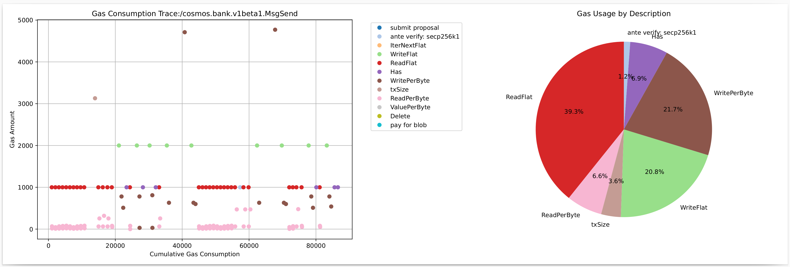
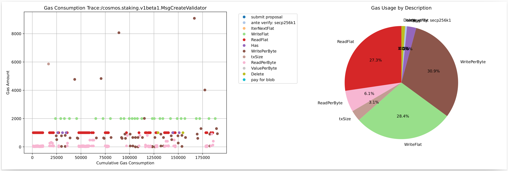

# Resource Pricing

For all standard cosmos-sdk transactions (staking, IBC, etc), Celestia utilizes
the [default cosmos-sdk mechanisms](https://docs.cosmos.network/v0.46/basics/gas-fees.html) for pricing resources. This involves
incrementing a gas counter during transaction execution each time the state is
read from/written to, or when specific costly operations occur such as signature
verification or inclusion of data.

```go
// GasMeter interface to track gas consumption
type GasMeter interface {
	GasConsumed() Gas
	GasConsumedToLimit() Gas
	GasRemaining() Gas
	Limit() Gas
	ConsumeGas(amount Gas, descriptor string)
	RefundGas(amount Gas, descriptor string)
	IsPastLimit() bool
	IsOutOfGas() bool
	String() string
}
```

We can see how this gas meter is used in practice by looking at the store.
Notice where gas is consumed each time we write or read, specifically a flat
cost for initiating the action followed by a prorated cost for the amount of
data read or written.

```go
// Implements KVStore.
func (gs *Store) Get(key []byte) (value []byte) {
	gs.gasMeter.ConsumeGas(gs.gasConfig.ReadCostFlat, types.GasReadCostFlatDesc)
	value = gs.parent.Get(key)

	// TODO overflow-safe math?
	gs.gasMeter.ConsumeGas(gs.gasConfig.ReadCostPerByte*types.Gas(len(key)), types.GasReadPerByteDesc)
	gs.gasMeter.ConsumeGas(gs.gasConfig.ReadCostPerByte*types.Gas(len(value)), types.GasReadPerByteDesc)

	return value
}

// Implements KVStore.
func (gs *Store) Set(key []byte, value []byte) {
	types.AssertValidKey(key)
	types.AssertValidValue(value)
	gs.gasMeter.ConsumeGas(gs.gasConfig.WriteCostFlat, types.GasWriteCostFlatDesc)
	// TODO overflow-safe math?
	gs.gasMeter.ConsumeGas(gs.gasConfig.WriteCostPerByte*types.Gas(len(key)), types.GasWritePerByteDesc)
	gs.gasMeter.ConsumeGas(gs.gasConfig.WriteCostPerByte*types.Gas(len(value)), types.GasWritePerByteDesc)
	gs.parent.Set(key, value)
}
```

The configuration for the gas meter used by Celestia is as follows.

```go
// KVGasConfig returns a default gas config for KVStores.
func KVGasConfig() GasConfig {
	return GasConfig{
		HasCost:          1000,
		DeleteCost:       1000,
		ReadCostFlat:     1000,
		ReadCostPerByte:  3,
		WriteCostFlat:    2000,
		WriteCostPerByte: 30,
		IterNextCostFlat: 30,
	}
}

// TransientGasConfig returns a default gas config for TransientStores.
func TransientGasConfig() GasConfig {
	return GasConfig{
		HasCost:          100,
		DeleteCost:       100,
		ReadCostFlat:     100,
		ReadCostPerByte:  0,
		WriteCostFlat:    200,
		WriteCostPerByte: 3,
		IterNextCostFlat: 3,
	}
}
```

Two notable gas consumption events that are not Celestia specific are the total
bytes used for a transaction and the verification of the signature

```go
func (cgts ConsumeTxSizeGasDecorator) AnteHandle(ctx sdk.Context, tx sdk.Tx, simulate bool, next sdk.AnteHandler) (sdk.Context, error) {
	sigTx, ok := tx.(authsigning.SigVerifiableTx)
	if !ok {
		return ctx, sdkerrors.Wrap(sdkerrors.ErrTxDecode, "invalid tx type")
	}
	params := cgts.ak.GetParams(ctx)

	ctx.GasMeter().ConsumeGas(params.TxSizeCostPerByte*sdk.Gas(len(ctx.TxBytes())), "txSize")
    ...
}

// DefaultSigVerificationGasConsumer is the default implementation of SignatureVerificationGasConsumer. It consumes gas
// for signature verification based upon the public key type. The cost is fetched from the given params and is matched
// by the concrete type.
func DefaultSigVerificationGasConsumer(
	meter sdk.GasMeter, sig signing.SignatureV2, params types.Params,
) error {
	pubkey := sig.PubKey
	switch pubkey := pubkey.(type) {
	case *ed25519.PubKey:
		meter.ConsumeGas(params.SigVerifyCostED25519, "ante verify: ed25519")
		return sdkerrors.Wrap(sdkerrors.ErrInvalidPubKey, "ED25519 public keys are unsupported")

	case *secp256k1.PubKey:
		meter.ConsumeGas(params.SigVerifyCostSecp256k1, "ante verify: secp256k1")
		return nil

	case *secp256r1.PubKey:
		meter.ConsumeGas(params.SigVerifyCostSecp256r1(), "ante verify: secp256r1")
		return nil

	case multisig.PubKey:
		multisignature, ok := sig.Data.(*signing.MultiSignatureData)
		if !ok {
			return fmt.Errorf("expected %T, got, %T", &signing.MultiSignatureData{}, sig.Data)
		}
		err := ConsumeMultisignatureVerificationGas(meter, multisignature, pubkey, params, sig.Sequence)
		if err != nil {
			return err
		}
		return nil

	default:
		return sdkerrors.Wrapf(sdkerrors.ErrInvalidPubKey, "unrecognized public key type: %T", pubkey)
	}
}
```

Since gas is consumed in this fashion and many of the cosmos-sdk transactions
are composable, any given transaction can have a large window of possible gas
consumption. For example, vesting accounts use more bytes of state than a normal
account, so more gas is consumed each time a vesting account is read from or
updated.

## Parameters

There are three parameters that can be modified via governance to modify gas
usage.

| Parameter       | Default Value | Description                             |
|-----------------|---------------|-----------------------------------------|
| consensus/max_gas     | -1     | The maximum gas allowed in a block. Default of -1 means this value is not capped.             |
| auth/tx_size_cost_per_byte | 10 | Gas used per each byte used by the transaction. |
| auth/sig_verify_cost_secp256k1 | 1000 | Gas used per verifying a secp256k1 signature |
| blob/gas_per_blob_byte | 8 | Gas used per byte used by blob. Note that this value is applied to all encoding overhead, meaning things like the padding of the remaining share and namespace. See PFB gas estimation section for more details. |

## Gas Limit

The gas limit must be included in each transaction. If the transaction exceeds
this gas limit during the execution of the transaction, then the transaction
will fail.

> Note: When a transaction is submitted to the mempool, the transaction is not
> fully executed. This can lead to a transaction getting accepted by the mempool
> and eventually included in a block, yet failing because the transaction ends
> up exceeding the gas limit.

Fees are not currently refunded. While users can specify a gas price, the total
fee is then calculated by simply multiplying the gas limit by the gas price. The
entire fee is then deducted from the transaction no matter what.

## Fee market

By default, Celestia consensus nodes will use mempools that prioritize fees,
however mempool usage cannot be enforced at the protocol level. There is
currently no enforced minimum fee, this value is set by each consensus node in
their `app.toml`. Transactions that do not exceed that given gas price will not
be able to enter that node's mempool, and thus they will also not be
gossiped by that node.

## Estimating PFB cost

Generally, the gas used by a PFB transaction involves a static "fixed cost" and
a dynamic cost based on the size of each blob involved in the transaction.

> Note: For a general use case of a normal account submitting a PFB, the static
> costs can be treated as such. However, due to the description above of how gas
> works in the cosmos-sdk this is not always the case. Notably, if we use a
> vesting account or the `feegrant` modules, then these static costs change.

The "fixed cost" is an approximation of the gas consumed by operations outside
the function `GasToConsume` (for example, signature verification, tx size, read
access to accounts), which has a default value of 65,000.

> Note: the first transaction sent by an account (sequence number == 0) has an
> additional one time gas cost of 10,000. If this is the case, this should be
> accounted for.

Each blob in the PFB contributes to the total gas cost based on its size. The
function `GasToConsume` calculates the total gas consumed by all the blobs
involved in a PFB, where each blob's gas cost is computed by first determining
how many shares are needed to store the blob size. Then, it computes the product
of the number of shares, the number of bytes per share, and the `gasPerByte`
parameter. Finally, it adds a static amount per blob.

The gas cost per blob byte and gas cost per transaction byte are parameters that
could potentially be adjusted through the system's governance mechanisms. Hence,
actual costs may vary depending on the current settings of these parameters.

## Tracing Gas Consumption

This figure plots each instance of the gas meter being incremented as a colored
dot over the execution lifecycle of a given transaction. The y-axis is units of
gas and the x-axis is cumulative gas consumption. The legend shows which color
indicates what the cause of the gas consumption was.

This code used to trace gas consumption can be found in the `tools/gasmonitor` of the branch for [#2131](https://github.com/celestiaorg/celestia-app/pull/2131), and the script to generate the plots below can be found [here](https://gist.github.com/evan-forbes/948c8cf574f2f50b101c89a95ee1d43c) (warning: this script will not be maintained).

### MsgSend

Here we can see the gas consumption trace of a common send transaction for
1`utia`



### MsgCreateValidator

Here we examine a more complex transaction.



### PFB with One Single Share Blob


### PFB with Two Single Share Blobs

This PFB transaction contains two single share blobs. Notice the gas cost for
`pay for blob` is double what it is above due to two shares being used, and
there is also additional cost from `txSize` since the transaction itself is
larger to accomodate the second set of metadata in the PFB.


### 100KiB Single Blob PFB

Here we can see how the cost of a PFB with a large blob (100KiB) is quickly dominated by
the cost of the blob.


